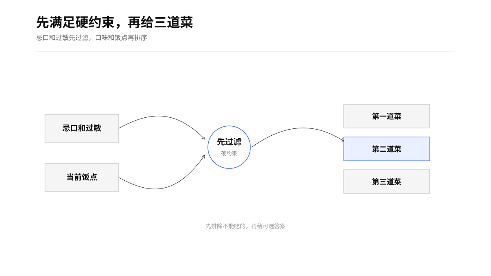
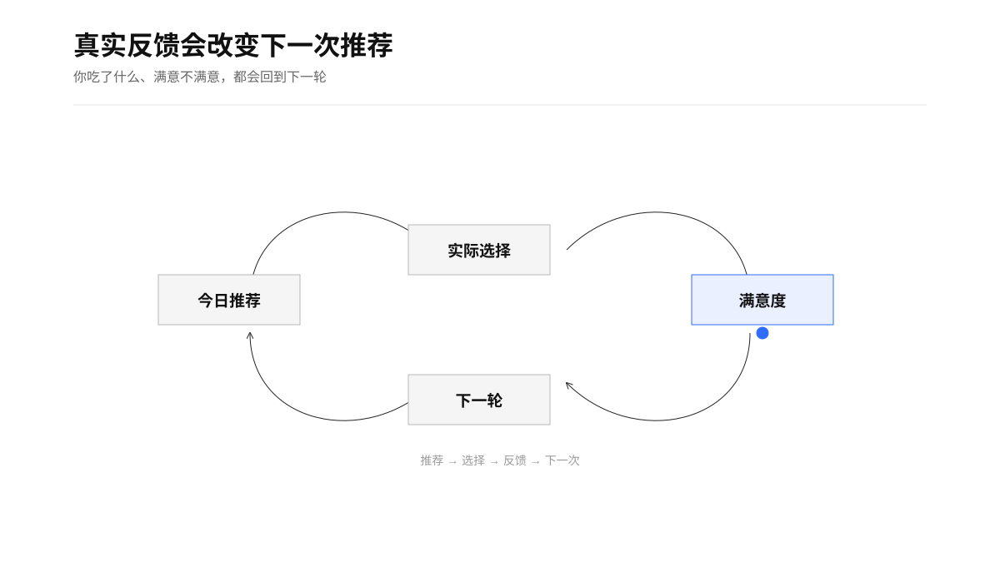
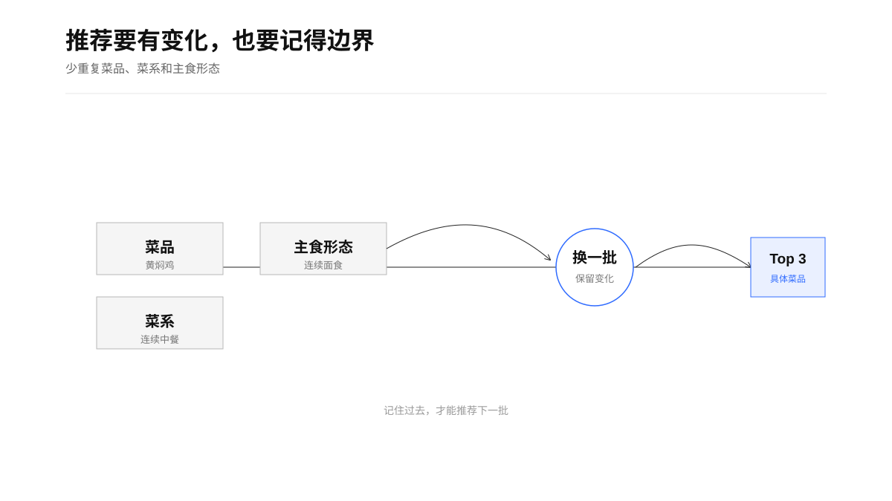

> “Tell me what you eat, and I will tell you what you are.” — Jean Anthelme Brillat-Savarin

# 吃什么 / What to Eat

一个帮助 Codex 快速决定早餐、午餐或晚餐吃什么的 Skill。

它会结合你的口味、忌口、当前饭点、近期真实饮食和反馈，给出三个具体菜品。它会记住你实际吃了什么，避免连续推荐同一道菜、同一菜系或同一种主食形态。

## Agent 使用契约（运行前必读）

实际 Skill 位于 [`skills/what-to-eat`](skills/what-to-eat)。Agent 每次运行先读取本地画像、近期饮食、推荐批次和短期记忆，再应用硬约束与重复控制。

| 项目 | 规则 |
| --- | --- |
| 触发 | 用户问早餐、午餐、晚餐吃什么，要求换一批，反馈选择，或记录实际饮食 |
| 首步 | 读取画像和近期记录；首次使用先收集必要的口味、忌口、饭点和提醒偏好 |
| 输入 | 当前饭点、画像、硬约束、近期真实饮食、最近推荐、短期记忆和用户反馈 |
| 输出 | 按推荐度排序的 Top 3 菜品，每项给出具体理由和提示；需要时附反馈选项 1–6 |
| 写入 | 推荐记录、实际饮食和反馈写入本地状态；定时提醒必须得到用户明确同意 |
| 安全 | 过敏、宗教/文化限制和明确忌口优先；孕期、术后、慢病、进食障碍和严重过敏只给一般建议并提示就医 |
| 降级 | 食材风险或状态不明时排除该菜；没有足够记录时说明依据，不虚构餐厅、价格、库存或链接 |

用户说“我吃了别的”时，以实际饮食记录更新状态，覆盖之前的选择记录。

<p align="center">
  
</p>

## 能做什么

- 首次使用时轻量收集口味和饮食限制
- 每次给出有明确排序的 Top 3 菜品
- 将过敏、忌口和饮食限制作为硬约束
- 记录真实饮食、选择和满意度
- 控制菜品、菜系、口味和形态重复
- 理解“换一批”“最近别推荐面”“我最后吃了黄焖鸡”等自然表达
- 可按你的三餐时间，在每餐前约 10 分钟主动发送当天建议

<p align="center">
  
</p>

它只推荐菜品，不推荐餐厅、外卖商家、实时价格或下单链接，也不提供医疗级饮食建议。

<p align="center">
  
</p>

## 安装

把 `skills/what-to-eat` 目录复制到你的 Codex Skills 目录：

```bash
cp -R skills/what-to-eat ~/.codex/skills/what-to-eat
```

重新打开 Codex 后，可以直接说“中午吃什么？”，也可以显式调用 `$what-to-eat`。

饮食画像和记录默认只保存在本机的 `~/.codex/state/what-to-eat/`，不会提交到这个仓库。

## English

What to Eat gives personalized Top 3 dish recommendations for breakfast, lunch, and dinner. It learns from actual meals and feedback, respects allergies and dietary restrictions, reduces repetition, and can proactively send suggestions about 10 minutes before each usual meal.

Copy `skills/what-to-eat` into `~/.codex/skills/what-to-eat`, reopen Codex, and ask “What should I eat for lunch?” Local food history stays under `~/.codex/state/what-to-eat/`.
